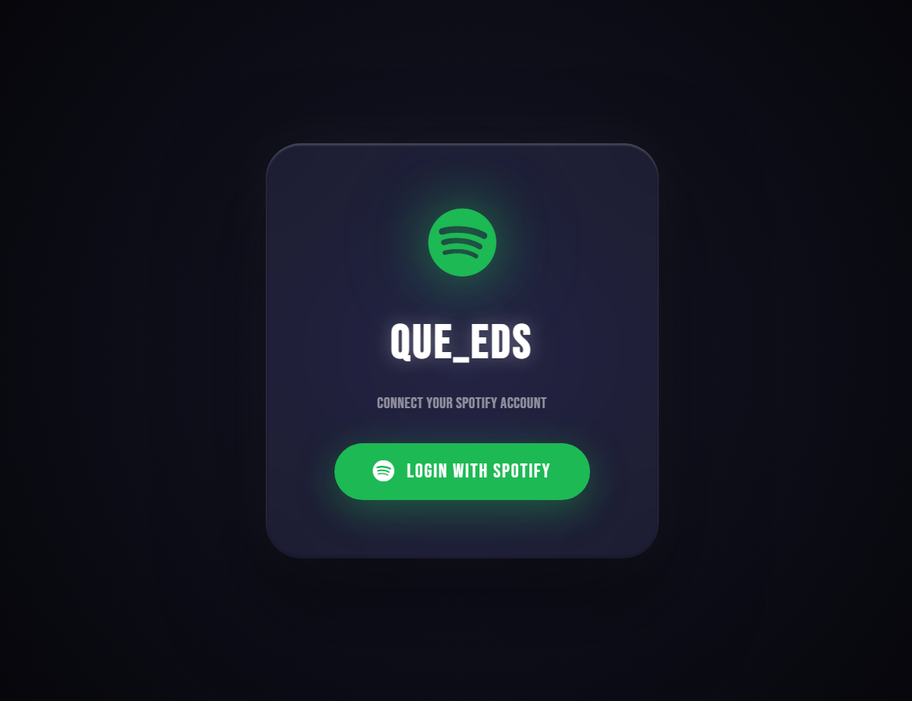
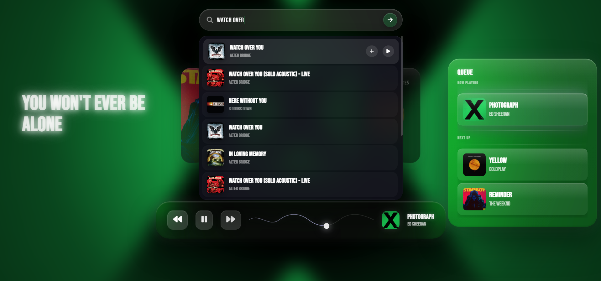
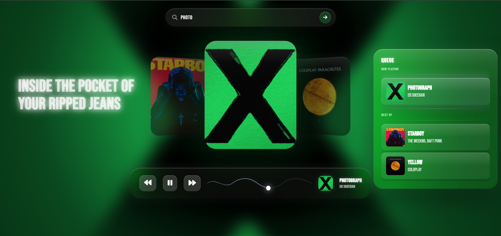
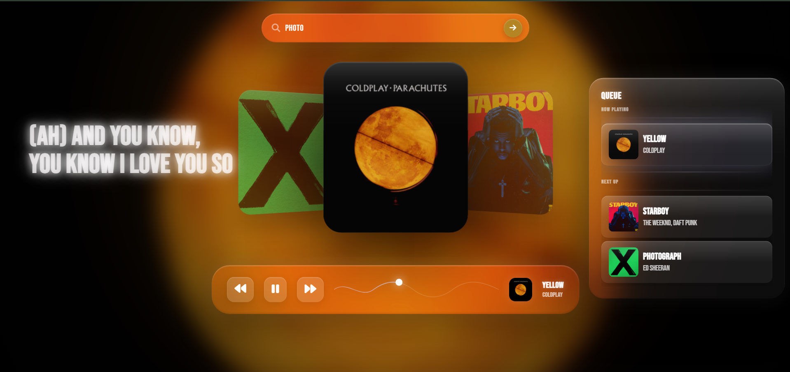

#  QUE_UEDS Music Player

A modern Liquid Glass Spotify music player built with vanilla JavaScript, Spotify Web Playback SDK, dynamic album color extraction, synchronized lyrics, and a glassmorphism-inspired UI.

##  Features

* Spotify Login (PKCE OAuth)
* Search any Spotify song
* Play music directly inside the browser
* Dynamic album artwork carousel
* Queue management
* Synchronized lyrics (LRCLIB)
* Dynamic background color extraction
* Liquid Glass UI
* Responsive design
* Spotify Web Playback SDK integration

---

##  Preview

| Login | Search |
|--------|--------|
|  |  |

| Music Player | Dynamic Colors |
|--------|--------|
|  |  |


---

##  Live Demo

Deploy on Netlify:

https://www.netlify.com/

---

##  Project Structure

```text
├── index.html
├── style.css
├── script.js
└── README.md
```

---

#  Spotify Developer Setup

Before running the project, you must create your own Spotify application.

## Step 1: Create Spotify App

Go to:

https://developer.spotify.com/dashboard

Click:

```text
Create App
```

Example:

```text
App Name: QUE_EDS Music Player
App Description: Personal Spotify Player
```

---

## Step 2: Configure Redirect URI

Inside your Spotify App settings:

```text
Redirect URI
```

Add:

For local development:

```text
http://127.0.0.1:5500/
```

or

```text
http://localhost:5500/
```

For Netlify:

```text
https://your-site.netlify.app/
```

Save changes.

---

## Step 3: Copy Client ID

Spotify will provide:

```text
Client ID
```

Copy it.

---

## Step 4: Update script.js

Open:

```javascript
// SPOTIFY CONFIG

const CLIENT_ID = "YOUR_CLIENT_ID";

const REDIRECT_URI =
    "https://your-site.netlify.app/";
```

Replace:

```javascript
YOUR_CLIENT_ID
```

with your Spotify Client ID.

Example:

```javascript
const CLIENT_ID =
    "xxxxxxxxxxxxxxxxxxxxxxxx";
```

---

#  Deploy to Netlify

## Option 1: Drag & Drop

1. Open Netlify
2. Login
3. Click

```text
Add new site
```

4. Select

```text
Deploy manually
```

5. Drag project folder

Netlify will instantly create a URL:

```text
https://random-name.netlify.app
```

---

## Option 2: GitHub Deployment

Push your project:

```bash
git init
git add .
git commit -m "Initial commit"
git branch -M main
git remote add origin YOUR_REPO_URL
git push -u origin main
```

Connect repository in Netlify.

Every push automatically redeploys.

---

##  Update Redirect URI

After Netlify gives you a URL:

Example:

```text
https://my-player.netlify.app/
```

Add the same URL inside:

### Spotify Dashboard

```text
Redirect URI
```

and inside:

```javascript
const REDIRECT_URI =
    "https://my-player.netlify.app/";
```

Both must match exactly.

---

#  Running Locally

Using VS Code:

Install:

```text
Live Server
```

Then:

```text
Right Click
→ Open with Live Server
```

---

#  Security Notes

Safe to expose:

```javascript
CLIENT_ID
```

Do NOT expose:

```text
Client Secret
Access Tokens
Refresh Tokens
```

This project uses Spotify PKCE authentication, so no Client Secret is required.

---

#  Lyrics Provider

Lyrics are fetched from:

```text
https://lrclib.net
```

---

#  Built With

* HTML5
* CSS3
* JavaScript
* Spotify Web Playback SDK
* Spotify Web API
* Color Thief
* LRCLIB

---

#  License

MIT License

Feel free to fork, modify, and improve the project.

---

##  Support

If you enjoyed the project:

```text
Give the repository a star ⭐
```

and share it with other music lovers.
